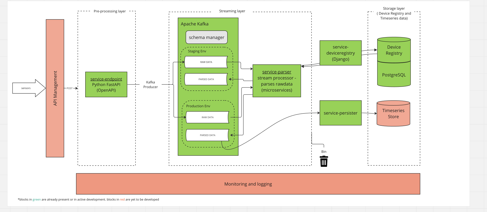

# mittaridatapumppu
Realtime data processing and management



# Introduction
The following repositories contain the services for the data pipeline shown in diagram above.

* [mittaridatapumppu](https://github.com/City-of-Helsinki/mittaridatapumppu): django app for storing device metadata into postgres db
* [mittaridatapumppu-endpoint](https://github.com/City-of-Helsinki/mittaridatapumppu-endpoint): a fastapi app that receives sensor data in POST requests and produces them to kafka
* [mittaridatapumppu-parser](https://github.com/City-of-Helsinki/mittaridatapumppu-parser): python based microservice that consumer streaming data and converts them from raw format to something else as defined in corresponding parser modules obtained from device metadata
* [mittaridatapumppu-persister](https://github.com/City-of-Helsinki/mittaridatapumppu-persister/):

# Build and Test
Go To [test set up](tests/README.md)

```
pip install pre-commit
pre-commit install
pip-compile
pip-compile --extra dev --output-file requirements-dev.txt
pip-sync
pre-commit run --all-files
```
